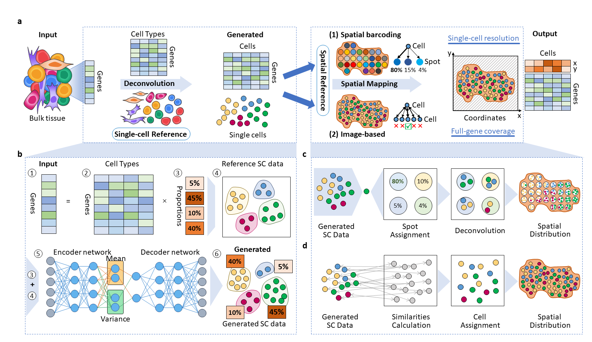

# Bulk2space

## Spatially resolved single-cell deconvolution of bulk transcriptomes using Bulk2Space 

[](https://www.python.org/) 

Bulk2Space is a spatial deconvolution method based on deep learning frameworks, which converts bulk transcriptomes into spatially resolved single-cell expression profiles.



# Installation
For bulk2space, the python version need is over 3.8. If you have installed Python3.6 or Python3.7, consider installing Anaconda, and then you can create a new environment.
```
conda create -n bulk2space python=3.8.5
conda activate bulk2space

cd bulk2space
pip install -r requirements.txt 
```

# Usage

## Run the demo data
If you choose the spatial barcoding-based data(like 10x Genomics or ST) as spatial reference, run the following command:
```
python bulk2space.py --project_name test1 --data_path example_data/demo1 --input_sc_meta_path demo1_sc_meta.csv --input_sc_data_path demo1_sc_data.csv --input_bulk_path demo1_bulk.csv --input_st_data_path demo1_st_data.csv --input_st_meta_path demo1_st_meta.csv --BetaVAE_H --epoch 10 --spot_data True
```

else, if you choose the image-based in situ hybridization data(like MERFISH, SeqFISH, and STARmap) as spatial reference, run the following command:
```
python bulk2space.py --project_name test2 --data_path example_data/demo2 --input_sc_meta_path demo2_sc_meta.csv --input_sc_data_path demo2_sc_data.csv --input_bulk_path demo2_bulk.csv --input_st_data_path demo2_st_data.csv --input_st_meta_path demo2_st_meta.csv --BetaVAE_H --epoch 10 --spot_data False
```

## Run your own data
When using your own data, make sure 
* the `bulk.csv` file must contain one column of gene expression

    |  | Sample | 
    | ----- | ----- | 
    | Gene1 | 5.22 |
    | Gene2 | 3.67 |
    | ... | ... |
    | GeneN | 15.76 |

* the `sc_meta.csv` file must contain two columns of cell name and cell type. Make sure the column names are correct, i.e., `Cell` and `Cell_type`

    |  | Cell | Cell_type |
    | ----- | ----- | ----- |
    | Cell_1 | Cell_1 | T cell |
    | Cell_2 | Cell_2 | B cell |
    | ... | ... | ... |
    | Cell_n | Cell_n | Monocyte |

* the `st_meta.csv` file must contain at least two columns of spatial coordinates. Make sure the column names are correct, i.e., `xcoord` and `ycoord`

    |  | xcoord | ycoord |
    | ----- | ----- | ----- |
    | Cell_1 / Spot_1 | 1.2 | 5.2 |
    | Cell_2 / Spot_2 | 5.4 | 4.3 |
    | ... | ... | ... |
    | Cell_n / Spot_n | 11.3 | 6.3 |

* the `sc_data.csv` and `st_data.csv` files are gene expression matrices

Then you will get your results in the `output_data` folder.

For more details, see [user guide]() in the document.
# About
Bulk2space manuscript is under major revision. Should you have any questions, please contact Jie Liao at liaojie@zju.edu.cn, Jingyang Qian at qianjingyang@zju.edu.cn, or Yin Fang at fangyin@zju.edu.cn