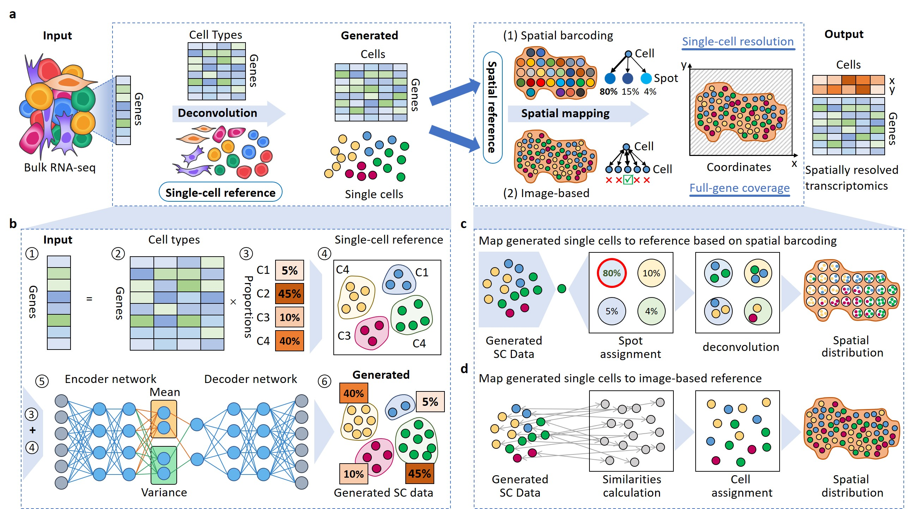

# Bulk2Space v1.0.0

## De novo analysis of bulk RNA-seq data at spatially resolved single-cell resolution 
### Jie Liao<sup>†</sup>,  Jingyang Qian<sup>†</sup>, Yin Fang<sup>†</sup>, Zhuo Chen<sup>†</sup>, Xiang Zhuang<sup>†</sup>, ..., Huajun Chen\*, Xiaohui Fan*

[](https://www.python.org/) [](https://doi.org/10.5281/zenodo.7134575) [ [](https://www.nature.com/articles/s41467-022-32111-8)

Bulk2Space is a two-step spatial deconvolution method based on deep learning frameworks, which converts bulk transcriptomes into spatially resolved single-cell expression profiles.



## Requirements and Installation
[](https://pypi.org/project/deep-forest/) [](https://github.com/numpy/numpy) [](https://github.com/pandas-dev/pandas) [](https://github.com/scikit-learn/scikit-learn) [](https://github.com/scipy/scipy) [](https://pypi.org/project/scanpy/) [](https://pypi.org/project/easydict/) [](https://pypi.org/project/tqdm/) [](https://pypi.org/project/Unidecode/) 

### Create and activate Python environment
For Bulk2Space, the python version need is over 3.8. If you have installed Python3.6 or Python3.7, consider installing Anaconda, and then you can create a new environment.
```
conda create -n bulk2space python=3.8
conda activate bulk2space
```
### Install pytorch
The version of pytorch should be suitable to the CUDA version of your machine. You can find the appropriate version on the [PyTorch website](https://pytorch.org/get-started/locally/).
Here is an example with CUDA11.6:
```
pip install torch --extra-index-url https://download.pytorch.org/whl/cu116
```
### Install other requirements
```
cd bulk2space-main
pip install -r requirements.txt
```
### Install Bulk2Space
```
python setup.py build
python setup.py install
```

## Quick Start
To use Bulk2Space we require five formatted `.csv` files as input (i.e. read in by pandas). We have included two test datasets 
in the [tutorial/data/example_data folder](tutorial/data/example_data) of this repository as examples to show how to use Bulk2Space. 

If you choose the spot-based data (10x Genomics, ST, or Slide-seq, etc) as spatial reference, please refer to:
* [Demonstration of Bulk2Space on demo1 dataset](tutorial/demo1.ipynb)

If you choose the image-based data (MERFISH, SeqFISH, or STARmap, etc) as spatial reference, please refer to:
* [Demonstration of Bulk2Space on demo2 dataset](tutorial/demo2.ipynb)

For more details about the format of input and the description of parameters, see the [Tutorial Handbook](tutorial/handbook.md).

 
## Tutorials
Additional step-by-step tutorials now available! Preprocessed datasets used can be downloaded from [Google Drive (PDAC)](https://drive.google.com/file/d/1xB-Gk_KLxQA320-tycJp4CFHA66zF3LE/view?usp=sharing) and [Google Drive (hypothalamus)](https://drive.google.com/file/d/1ZGstNzVX-YxofrPP8ZVmr0Zu4nd_O_bZ/view?usp=sharing).

* [Integrating spatial gene expression and histomorphology in pancreatic ductal adenocarcinoma (PDAC)](tutorial/pdac.ipynb)


* [Spatially resolved analysis of mouse hypothalamus by Bulk2Space](tutorial/hypothalamus.ipynb)

## About
Should you have any questions, please feel free to contact the co-first authors of the manuscript, Dr. Jie Liao (liaojie@zju.edu.cn), Mr. Jingyang Qian (qianjingyang@zju.edu.cn), Miss Yin Fang (fangyin@zju.edu.cn), Mr. Zhuo Chen (zhuo.chen@zju.edu.cn), or Mr. Xiang Zhuang (zhuangxiang@zju.edu.cn).

## References
Liao, J., Qian, J., Fang, Y. et al. De novo analysis of bulk RNA-seq data at spatially resolved single-cell resolution. Nat Commun 13, 6498 (2022). [https://doi.org/10.1038/s41467-022-34271-z](https://doi.org/10.1038/s41467-022-34271-z)

